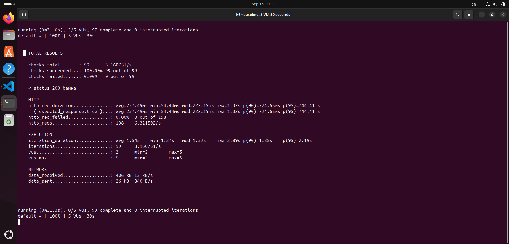

# Лаборатори 2 — k6

Ч. Мөнхбаяр — B242270045

**Зорилго**

k6 ашиглан `https://test.k6.io` дээр ачааллын тест хийж, VU нэмэгдэхэд latency, throughput, error rate яаж өөрчлөгдөхийг харьцуулсан. Мөн baseline үр дүндээ тулгуурлаж SLO болон threshold тохируулж шалгасан.

**Орчин**

- Ubuntu
- `k6 v2.2.0 (commit/00a9a1b7f5, go1.26.5, linux/amd64)`
- Туршсан хаяг: `https://test.k6.io`

**Ажиллуулах командууд**

```bash
k6 run script.js | tee results/run-05vu-baseline.txt
k6 run --vus 5 --duration 1m script.js | tee results/run-05vu.txt
k6 run --vus 30 --duration 1m script.js | tee results/run-30vu.txt
k6 run --vus 100 --duration 1m script.js | tee results/run-100vu.txt
k6 run script-stages.js | tee results/run-stages.txt
k6 run script-threshold.js | tee results/run-threshold-pass.txt
k6 run script-threshold-fail.js | tee results/run-threshold-fail.txt
```

**Baseline — 5 VU, 30 секунд**

| avg | p90 | p95 | Throughput | Error rate |
|---:|---:|---:|---:|---:|
| 237.49 мс | 724.65 мс | 744.41 мс | 6.32 req/s | 0.00% |

[Бүтэн үр дүн](results/run-05vu-baseline.txt)

<details>
<summary>Baseline screenshot</summary>



</details>

**5, 30, 100 VU харьцуулалт**

Тест бүрийг 1 минут ажиллуулсан.

| VU | p90 | p95 | Throughput | Error rate |
|---:|---:|---:|---:|---:|
| 5 | 735.34 мс | 753.56 мс | 6.21 req/s | 0.00% |
| 30 | 712.71 мс | 740.38 мс | 36.15 req/s | 0.00% |
| 100 | 744.45 мс | 787.56 мс | 123.73 req/s | 0.00% |

- [5 VU бүтэн үр дүн](results/run-05vu.txt) · [screenshot](screenshots/05vu.png)
- [30 VU бүтэн үр дүн](results/run-30vu.txt) · [screenshot](screenshots/30vu.png)
- [100 VU бүтэн үр дүн](results/run-100vu.txt) · [screenshot](screenshots/100vu.png)

**Stages тест**

Ачааллыг `30s → 5 VU`, `1m → 30 VU`, `30s → 100 VU`, `30s → 0 VU` гэсэн дарааллаар өөрчилсөн. Нийт p90 752.97 мс, p95 948.85 мс, throughput 37.89 req/s, error rate 0.00% гарсан.

[Бүтэн үр дүн](results/run-stages.txt) · [screenshot](screenshots/stages.png)

**SLO ба threshold**

Baseline p95 нь 744.41 мс байсан. Үүнийг 1.5-аар үржүүлээд `744.41 × 1.5 = 1116.62 мс` болсон тул SLO-г `p(95) < 1117 мс` гэж авсан. Error rate-ийн threshold-ийг `rate < 0.01` гэж тохируулсан.

| Туршилт | Threshold | Бодит үр дүн | Төлөв |
|---|---|---|---|
| Энгийн SLO | `p(95) < 1117 мс` | p95 = 1.10 сек, error = 0.00% | PASS |
| Зориуд хатуу SLO | `p(95) < 50 мс` | p95 = 1.11 сек, error = 0.00% | FAIL |

- [PASS бүтэн үр дүн](results/run-threshold-pass.txt) · [screenshot](screenshots/threshold-pass.png)
- [FAIL бүтэн үр дүн](results/run-threshold-fail.txt) · [screenshot](screenshots/threshold-fail.png)

FAIL тестийг threshold үнэхээр алдаа барьж байгааг шалгахын тулд зориуд хатуу утгатай ажиллуулсан.

**Файлууд**

- `script.js` — baseline болон тогтмол VU тест
- `script-stages.js` — үе шаттай ачааллын тест
- `script-threshold.js` — PASS болох threshold
- `script-threshold-fail.js` — зориуд FAIL болох threshold
- `results/` — бүх тестийн бүтэн гаралт
- `screenshots/` — k6 summary зургууд

**Дүгнэлт**

5 VU-г 1 минут ажиллуулахад p95 753.56 мс, throughput 6.21 req/s гарсан. 30 VU дээр p95 740.38 мс байсан ч throughput 36.15 req/s болсон. 100 VU дээр p95 787.56 мс, throughput 123.73 req/s хүрсэн. Ингэхээр ачаалал өсөхөд throughput бараг дагаж өссөн, харин latency бага хэмжээгээр л өөрчлөгдсөн. 30 VU-ийн p95 нь 5 VU-ээс бага гарсан нь гадаад сүлжээ болон `test.k6.io`-ийн тухайн үеийн хэлбэлзэл нөлөөлснийг харуулж байна. 100 VU дээр p95 өссөн тул их ачаалалтай үед хэрэглэгчийн хүлээх хугацаа бага зэрэг муудаж эхэлсэн. Stages тестийн p95 948.85 мс болсон нь ачааллыг хурдан өөрчлөх үед tail latency илүү өсөж байгааг харуулсан. Baseline p95-ийг 1.5-аар үржүүлж 1117 мс SLO тавихад p95 1.10 секунд, error rate 0% байсан учраас тест PASS болсон. Харин 50 мс-ийн зориуд хатуу threshold p95 1.11 секунд дээр FAIL болсон бөгөөд HTTP error 0% байсан ч threshold нь performance quality gate болж чаддагийг баталсан.
